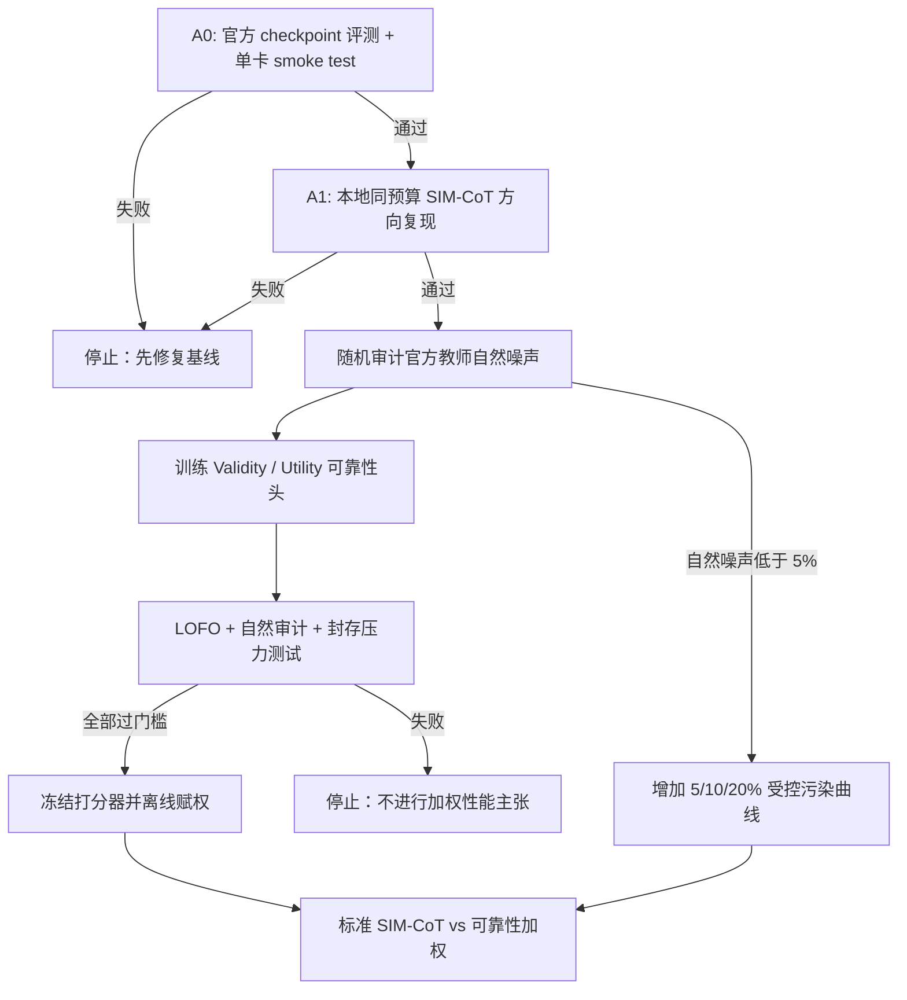

# 面向教师自然噪声的可靠性门控 SIM-CoT 实验设计

- **状态：** 已批准设计，待书面规格复核
- **日期：** 2026-08-05
- **硬件约束：** 单张 NVIDIA RTX 4060，8 GB 显存
- **主要数据来源：** 官方 [SIM-CoT 仓库](https://github.com/InternLM/SIM-CoT) 与 [论文](https://arxiv.org/html/2509.20317v2) 中的 GSM8K-Aug 教师步骤

## 1. 研究问题与核心主张

本实验研究：当官方教师生成的训练推理步骤中自然混入错误、无关或冗余步骤时，能否用一个冻结的、在隐空间与文本空间联合工作的步骤可靠性头，识别这些低可靠性步骤，并在 SIM-CoT 蒸馏中降低它们的监督权重，从而优于标准的等权 SIM-CoT。

这里的“噪声”只指**教师训练轨迹中的自然噪声**。最终测试集保持官方、干净、无人工加噪；研究目标不是提高模型对推理时输入噪声的鲁棒性，而是降低训练阶段错误或低价值教师步骤对 Student 的伤害。

主比较必须是：

- 标准 SIM-CoT：官方教师步骤全部等权；
- 本方法：相同教师步骤由冻结可靠性头离线赋权；
- Coconut：作为次要基线，用于确认引入可靠性机制后没有丢失 SIM-CoT 相对基础方法的优势。

核心可证伪主张分为两级：

1. **检测主张：** 可靠性头能在未见题目、未见污染族以及自然教师步骤上识别低可靠性步骤。
2. **训练主张：** 通过检测门槛后，离线可靠性加权能在标准干净测试集上优于相同预算的等权 SIM-CoT。

若检测主张不成立，则停止加权训练，不用下游偶然波动为检测器“兜底”。

## 2. 研究边界

### 2.1 本轮包含

- 复现和验证官方 SIM-CoT 基线；
- 审计官方教师训练步骤中的自然低可靠性比例；
- 构造覆盖多类失效机制的训练污染与整类留出评测；
- 训练 Validity/Utility 双头步骤可靠性模型；
- 在检测门槛通过后开展等权与加权蒸馏对照；
- 在自然噪声不足时，用受控污染曲线补充因果证据。

### 2.2 本轮不包含

- 给最终测试题或测试推理过程人工加噪；
- 端到端联合训练 Student 与可靠性头；
- 动态在线重算步骤权重；
- 把 RSR 或 RD 直接解释为正确率；
- 在一晚内完整训练官方 385k 样本规模的模型；
- 在检测门槛失败后继续宣称加权方法有效。

## 3. 阶段 A：先复现标准 SIM-CoT

官方 GSM8K-Aug 约含 385k 条由 GPT-4 生成的结构化推理样本，数据字段为 `question`、`steps`、`answer`。官方 GPT-2 规模 Coconut+SIM-CoT 报告的准确率为：GSM8K-Aug 44.8%、GSM-Hard 12.2%、MultiArith 9.3%、SVAMP 90.8%。

由于官方训练设置面向多卡，而本机只有 8 GB 显存，复现分成两个门槛，避免把“下载并评测官方权重”和“本地完整训练复现”混为一谈。

### 3.1 A0：一晚内完成的数值与工程门槛

先评测官方 checkpoint，并核对四个数据集：

- 每个数据集的结果与官方报告相差不超过 1.0 个百分点；
- 评测脚本的答案提取、样本数量和数据版本均被记录；
- checkpoint 能在本机加载并完成端到端推理。

随后做单卡短训练 smoke test：

- loss 为有限值且总体下降；
- latent step 与目标 step 对齐无偏移；
- checkpoint 能保存、重载并继续训练；
- 峰值 reserved 显存不超过 7.4 GB；
- 梯度累积后的有效 batch size 被明确记录。

A0 任何一项失败，都先修复基线，不进入新方法。

### 3.2 A1：方法比较前的本地复现门槛

在进入最终加权对照前，使用同一训练预算完成 Coconut 与标准 SIM-CoT 的本地短预算复现。标准 SIM-CoT 的四数据集宏平均准确率应比 Coconut 至少高 2.0 个百分点，并与官方报告方向一致。

一晚的诚实交付范围是 A0；A1 以及后续完整对照可能需要多晚。不得把短 smoke test 写成完整复现。

## 4. 阶段 B：自然教师噪声审计

教师由 GPT-4 生成并不等于步骤无噪声，因此先估计自然噪声是否足以支持主实验。

### 4.1 随机封存的流行率审计集

从官方训练集按题目随机抽取并封存至少 2,000 个步骤。该集合在比例估计前不得经过异常筛选。

审计分两层：

1. 自动检查结构化表达式等式、运算符与结果、变量/数值依赖、步骤顺序以及最终答案支持关系；
2. 对自动检查不确定的样本和 Utility 标签进行人工复核，特别关注逻辑上有效但无关、重复或没有新增信息的步骤。

报告以下比例及置信区间：

- invalid steps：逻辑、事实、计算或依赖不成立；
- valid but low-utility steps：正确但无关、冗余或不推进解题；
- 至少含一个低可靠性步骤的完整轨迹。

预先固定解释规则：

- 自然低可靠性比例 ≥ 5%：直接以自然噪声实验为主；
- 1%–5%：保留自然实验，同时增加 5%、10%、20% 的受控污染曲线；
- < 1%：官方数据只用于复现 SIM-CoT，主要因果实验改为受控污染，不声称官方数据存在足量自然噪声。

### 4.2 自然噪声检测审计集

随机流行率集合在低噪声条件下可能只有极少数正例，无法稳定估计检测性能。因此在完成无偏比例估计后，另建一个题目级封存、正例富集且类别平衡的检测审计集，目标至少包含：

- 100 个经确认的低可靠性步骤，并尽量保证 invalid 与 valid-but-low-utility 各不少于 50 个；
- 100 个题目难度、步骤位置和长度尽量匹配的干净步骤。

该集合只能用于最终检测评估，不参与训练、验证、阈值选择或温度校准，也必须从后续蒸馏训练数据中删除。

## 5. 阶段 C：可靠性头训练数据与整类留出

### 5.1 先按题目切分

在生成任何正负变体前，先按题目 ID 将候选数据固定切为：

- 60%：head-train；
- 20%：head-validation；
- 20%：head-audit。

同一题目的原始步骤、改写步骤和所有污染版本只能出现在同一个 split，防止题目或模板泄漏。

### 5.2 正样本

- 原始干净步骤；
- 语义等价的自然语言改写；
- 数学上等价、表达形式不同的计算。

等价改写用于阻止分类器把措辞变化误判成噪声。

### 5.3 五个开发污染族

1. **数值污染：** 改错中间数值或计算结果，Validity=0；
2. **运算符/关系污染：** 替换运算符、比较关系或等式方向，Validity=0；
3. **依赖/顺序污染：** 使用尚未得到的结果、与前缀矛盾或破坏依赖链，Validity=0；
4. **无关但正确：** 插入事实正确、却与当前解题无关的步骤，Validity=1、Utility=0；
5. **冗余/重复：** 重复已经获得的信息或做不增加进展的等价展开，Validity=1、Utility=0。

污染生成时尽量匹配原步骤的长度、标点、数字个数和步骤位置。模型不能接收污染族或模板标签。

### 5.4 整类留出（LOFO）

执行五轮 leave-one-family-out：每轮完整留出一个污染族，仅用其余四族的 head-train 题目训练，用相同四族的 head-validation 题目做校准和早停，最后在题目不重叠的被留出污染族上审计。

该设计检验模型学习的是跨机制的“步骤可靠性”，而不是记住某一污染模板。报告五轮宏平均 AUC 和最差污染族 AUC。

### 5.5 永久封存的合成压力族

另构造“补偿性错误”族：多个中间错误相互抵消，最终答案仍正确。该族从不参与训练、早停、阈值、温度或模型选择，只在模型结构和决策规则冻结后打开一次。

若打开后修改方法，旧结果自动降级为开发结果，必须新建另一套封存压力集。自然教师审计集是主要外部检验；补偿性错误只是辅助压力测试，不能替代自然证据。

### 5.6 最终可靠性头

五轮 LOFO 只用于检验整类泛化并冻结架构、损失和超参数。LOFO 达到门槛后，使用全部五个开发污染族的 head-train 题目训练一个最终可靠性头；head-validation 仅用于早停和温度校准。随后冻结该头，依次打开自然教师检测审计集和补偿性错误压力集进行一次性评测。

自然审计或封存压力结果不得反向用于选择 checkpoint、改阈值或调温度。用于最终蒸馏的就是这个冻结的最终可靠性头，且自然检测审计题目已从蒸馏训练集中删除。

## 6. Validity 与 Utility 标签

每一步输出两个不同概念：

- **Step Validity（步骤有效性）**：给定题目和此前步骤，该步骤在逻辑、事实、计算及依赖上是否成立；
- **Marginal Step Utility（步骤边际有用性）**：在步骤有效的前提下，该步骤是否提供新的、与任务相关的解题进展。

Utility 只在 Validity=1 时定义；无效步骤不参与 Utility loss。标签表如下：

| 样本类型 | Validity | Utility |
| --- | ---: | ---: |
| 原始干净/等价改写 | 1 | 1 |
| 数值、运算符、依赖错误 | 0 | 不计分 |
| 无关但正确 | 1 | 0 |
| 冗余/重复但正确 | 1 | 0 |

最终步骤监督可靠性定义为：

\[
r_t = v_t \times u_t,
\]

其中 \(v_t\) 与 \(u_t\) 是两个头的校准概率。复合标签定义为：只有 Validity=1 且 Utility=1 才是高可靠性，其余已定义情形均为低可靠性。该乘积称为 **Step Supervision Reliability（步骤监督可靠性）**。

## 7. 可靠性头架构

### 7.1 冻结特征源

以阶段 A 复现并冻结的 SIM-CoT Student 为隐状态来源，同时保留一个仅训练期使用的辅助解码器。对步骤 \(t\)：

- \(z_t\)：当前 latent step 表示；
- \(z_{t-1}\)：前一 latent step 表示，首步使用全零向量；
- \(h_{t,j}\)：辅助解码器在 teacher forcing 下对第 \(j\) 个步骤 token 的隐藏状态。

使用 padding mask 做平均池化：

\[
e_t = \frac{\sum_j m_{t,j} h_{t,j}}{\sum_j m_{t,j}}.
\]

平均池化把长度可变的 token 序列变成一个固定维度的步骤语义向量，padding 不参与平均。

### 7.2 独立投影与交互

隐空间状态和文本解码状态不在同一表示空间，因此分别投影到 128 维共享任务空间：

\[
a_t = \mathrm{LN}\left(W_z[z_{t-1};z_t;z_t-z_{t-1}]\right),
\]

\[
b_t = \mathrm{LN}(W_e e_t).
\]

以 GPT-2 的 \(d=768\) 为例，隐空间输入维度为 2304，文本空间输入维度为 768。交互特征为：

\[
x_t=[a_t;b_t;|a_t-b_t|;a_t\odot b_t].
\]

一个小型共享 MLP 处理 512 维交互特征，再连接两个 sigmoid 输出头得到 \(v_t\) 与 \(u_t\)。新增参数目标控制在约 50 万以内。

该结构不把余弦相似度当作噪声判定器。投影层学习跨空间的任务相关对齐，MLP 学习“当前步骤是否与题目和前缀一致、是否提供新进展”的非线性关系。

### 7.3 冻结策略

Student、辅助解码器和所有特征都 stop-gradient；只训练 \(W_z\)、\(W_e\)、共享 MLP 与两个输出头。辅助解码器只用于可靠性特征抽取，推理部署时移除。

## 8. 可靠性头目标函数与校准

分类损失：

\[
L_v=\mathrm{BCE}(v_t,y^v_t),
\]

\[
L_u=\mathbb{1}[y^v_t=1]\,\mathrm{BCE}(u_t,y^u_t).
\]

同题、同位置成对排序损失：

\[
L_{rank,v}=\max(0,0.2-v_{clean}+v_{invalid}),
\]

\[
L_{rank,u}=\max(0,0.2-u_{useful}+u_{useless}).
\]

总损失固定为：

\[
L_{head}=L_v+L_u+0.5L_{rank,v}+0.5L_{rank,u}.
\]

同题成对排序通过共享题目、步骤位置和大致表面形式控制难度，使模型学习局部优先级；BCE 同时保留绝对概率校准。首版不搜索 margin 或损失权重。

训练 batch 做类别平衡；Utility batch 只在有效步骤中平衡 useful/useless。两个头的温度缩放仅在未经类别重采样的 head-validation 上拟合，并记录校准前后的 Brier score 与可靠性图，避免把平衡训练后的原始 sigmoid 分数误当作总体概率。

## 9. 检测门槛与捷径审计

只有以下条件全部满足，才进入加权蒸馏：

- 合成五轮 LOFO 的复合可靠性 \(r=v\times u\) 宏平均 ROC-AUC ≥ 0.75；
- 最差留出污染族 ROC-AUC ≥ 0.70；
- 自然教师检测审计集的复合可靠性 ROC-AUC ≥ 0.75；
- 封存“补偿性错误”族的 Validity ROC-AUC ≥ 0.70；
- 等价改写相对原步骤的平均可靠性下降不超过 0.10。

同时分别报告 Validity ROC-AUC 与 Utility ROC-AUC；Utility 只在真实 Validity=1 的步骤中计算。

捷径审计必须报告可靠性分数与以下变量的相关性及分层结果：

- token 长度；
- 数字个数；
- 步骤位置；
- 标点和格式；
- 污染模板 ID（只用于离线审计，不输入模型）。

若模型主要依赖表面特征、任一硬门槛失败，或自然审计样本不足，则停止自然加权主张，回到数据和表示设计。

## 10. 阶段 D：离线权重与蒸馏损失

通过检测门槛后，用冻结的 Student、辅助解码器和可靠性头对官方训练步骤离线打分，并把分数写入派生训练数据。下游蒸馏不再动态调用可靠性模型，也不允许梯度流回可靠性头。

为避免把潜在有用步骤完全删除，先设置权重下限：

\[
\tilde{w}_t=0.1+0.9r_t.
\]

再在每条含 \(K\) 个步骤的样本内部归一化，使平均步骤权重为 1：

\[
w_t=\frac{K\tilde{w}_t}{\sum_{j=1}^{K}\tilde{w}_j}.
\]

训练损失为：

\[
L=L_{answer}+\frac{\lambda}{K}\sum_{t=1}^{K}w_tL_{step,t}.
\]

最终答案 loss 始终不加权。标准 SIM-CoT 对照固定 \(w_t=1\)。样本内归一化保证总的步骤监督强度与等权组相近，减少“仅仅因为总体梯度变小”造成的混淆。

## 11. 对照、指标与成功标准

### 11.1 自然教师数据主对照

所有方法使用同一份官方教师步骤：

1. Coconut；
2. 标准 SIM-CoT，步骤等权；
3. 本方法，Validity×Utility 预测权重。

若存在可程序验证的干净子集，可作为上界参考，但不能把合成 oracle 冒充自然数据 oracle。

严格固定：初始化 checkpoint、样本顺序、训练更新数、优化器、学习率日程、有效 batch size、截断规则和随机种子。标准组与加权组唯一允许的主差异是 \(w_t\)。

官方干净测试集：GSM8K-Aug、GSM-Hard、MultiArith、SVAMP。主指标为四个数据集准确率的宏平均；同时报告各数据集准确率、干净审计步骤 NLL、训练稳定性和置信区间。

单种子筛选成功标准：

- 本方法宏平均准确率 ≥ 标准 SIM-CoT +1.0 个百分点；
- GSM8K-Aug 准确率相对标准 SIM-CoT 的下降不超过 1.0 个百分点；
- 干净审计步骤 NLL 优于标准 SIM-CoT。

筛选通过后才运行 3 个随机种子并报告均值、标准差及 bootstrap 置信区间。若单种子只改善 NLL 而不改善答案准确率，结论只能是“改善步骤拟合”，不能宣称任务性能提高。

### 11.2 自然噪声不足时的受控因果曲线

若阶段 B 的自然低可靠性比例低于 5%，增加 5%、10%、20% 污染率的严格匹配对照：

- 原始干净训练；
- 受控污染 + 等权 SIM-CoT；
- 受控污染 + 预测加权；
- 受控污染 + oracle 加权。

该曲线回答“已知噪声强度增加时，预测权重能恢复多少由噪声造成的性能损失”。它是因果补充，不应被写成官方自然噪声结果。

### 11.3 确认性消融

- Validity-only；
- Utility-only；
- Validity×Utility；
- 原 RSR/RD 评分基线；
- 受控污染上的 oracle 权重。

RSR/RD 只作为经验基线。由于 RSR 衡量信息性—对齐性而非正确率，异常高 surprisal 可能让错误短步骤获得极低 RSR，因此不得继续把低 RSR 直接解释为高质量监督。

## 12. 单卡执行、失败处理与可复现性

### 12.1 8 GB 显存策略

- 可靠性特征离线缓存，五轮小头训练不重复运行大模型；
- 使用混合精度、梯度累积、gradient checkpointing 和小 micro-batch；
- 正式训练前运行 20-step preflight；
- 峰值 reserved 显存超过 7.4 GB 即触发统一降配；
- 相互比较的分支必须使用同一 OOM 回退规则，禁止只对某组额外截断或冻结。

### 12.2 立即中止条件

- loss、分数或权重出现 NaN/Inf；
- 任一样本的有效 token mask 为空；
- Utility loss 计入 invalid 样本；
- 同题或其变体跨 split；
- 权重归一化后均值显著偏离 1；
- checkpoint 损坏或重载结果不一致；
- 封存集在冻结前被访问。

### 12.3 必须记录

- 数据版本、样本 ID 与切分 hash；
- 模型与 tokenizer revision；
- 配置、随机种子、代码 commit；
- 每轮训练的峰值显存、耗时、有效 batch size；
- 特征缓存 hash、可靠性头 checkpoint hash；
- 官方评测脚本版本和答案提取规则。

## 13. 最低测试清单

- mask-aware mean pooling 不把 padding 纳入平均；
- 题目 ID 与所有派生变体不会跨 split；
- Utility loss 只在 Validity=1 时非零；
- 成对排序样本具有相同题目与步骤位置；
- 每条样本的权重有限、非负且均值为 1；
- 离线特征缓存可重复生成且 hash 一致；
- 冻结模型确实无梯度；
- 封存审计集在 freeze 标记前不可读；
- checkpoint 保存、重载后的固定输入输出一致；
- 标准组和加权组除权重外的训练配置逐字段一致。

## 14. 决策流程与最终解释边界

最终结论必须服从证据强度：

- 自然噪声充足、检测过门槛且多种子下游改善：可以支持“可靠性加权缓解官方教师自然噪声”；
- 只有受控污染改善：只能支持“对构造的训练噪声具有鲁棒性”；
- 只有检测 AUC 达标而下游不改善：说明可检测不等于对蒸馏有用；
- 只有 NLL 改善而准确率无改善：只报告步骤拟合改善；
- 标准 SIM-CoT 未复现：不解释新方法结果。

这组边界确保研究贡献不是简单拼接“辅助头 + 加权 loss”，而是一个经由整类留出、自然封存审计、独立检测门槛和下游因果对照共同验证的、可被证伪的训练监督可靠性框架。
