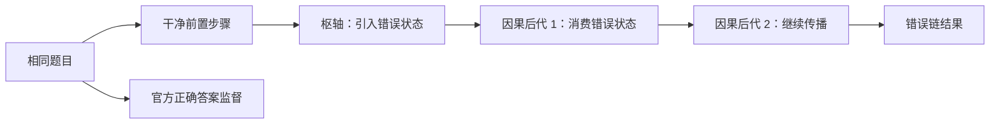

# 两阶段因果传播噪声与步骤加权实验设计

**日期：** 2026-08-10

**状态：** 已批准并执行；开发集伤害校准未过门，正式六臂与官方测试评估按预注册规则停止

**硬件约束：** NVIDIA RTX 4060 Laptop GPU，8 GB 显存

**上游证据：** 20% 与 40% 孤立步骤污染均未建立稳定的噪声伤害；40% 等权污染组相对干净组的 EM 点估计反而提高 0.986 pp。因此，本设计不再继续机械增加原污染比例，而是改变污染的因果结构。

## 1. 研究问题

本实验分两个阶段回答两个不同问题：

1. **阶段 A——机制证明：** 当一个错误中间状态确实传播到后续推理步骤时，完美知道污染因果范围并对其降权，能否恢复等权训练受到的伤害？
2. **阶段 B——现实验证：** 阶段 A 通过后，相同的因果范围加权能否处理官方教师轨迹中经程序和人工确认的自然错误？

阶段 A 优先获得清晰的因果处理，允许错误比自然教师噪声更强。阶段 B 优先真实性，但不得用自然案例替代阶段 A 的机制门控。

## 2. 核心原则

- 题目文本和官方最终答案监督始终保持干净。
- 只污染辅助推理步骤，避免错误答案损失混入处理效应。
- 错误不能只是孤立替换一句文本，必须产生可验证的错误中间状态，并被后续步骤消费。
- 选择噪声强度只能使用开发集；官方测试集在配置冻结前保持封存。
- 阶段 A 使用程序生成和程序验证的标签，不使用大模型主观判断作为 ground truth。
- 阶段 B 可用辅助模型提出候选或解释，但最终标签必须来自可执行验证或人工裁决。

## 3. 阶段 A 数据资格与依赖图

每条官方干净轨迹先被解析成有向依赖图。节点是推理步骤，边 `i → j` 表示步骤 `j` 的算式明确消费步骤 `i` 的结果。

一条轨迹只有同时满足以下条件才可进入因果污染实验：

1. 前五个辅助监督步骤均可解析；
2. 前五步中存在一条包含三个节点的有向路径；
3. 路径上的第二、第三个节点能唯一定位其所消费的上游结果；
4. 路径的错误状态可继续沿完整官方轨迹重放，并影响最终推理结果；
5. 依赖来源不存在同值歧义；若同一数值可能来自多个步骤，则拒绝该候选；
6. 完整干净和污染版本均不超过 1,024 tokens。

主实验固定每个被污染样本包含三个受影响的辅助步骤：一个直接错误枢轴和两个因果后代。枢轴仅允许位于前五步中的第 1、2 或 3 步；两个后代也必须位于前五步，依赖路径可以跨过不相关的旁支步骤。未位于该因果路径上的步骤保持干净。若完整轨迹超过五步，生成器继续重放剩余步骤以验证错误最终可达答案，但训练权重只应用于前五个辅助监督步骤。



## 4. 三类程序化传播错误

三类错误在每个日程中的样本数差不得超过 1；三个可用枢轴位置的样本数差也不得超过 1。若合格候选池不能满足平衡约束，则日程构建失败，不允许用重复样本或弱化验证规则补齐。任何一类错误都必须产生与干净轨迹不同的错误状态，并通过相同的传播验证。

### 4.1 数值偏移错误

保持枢轴左侧表达式不变，将其结果从 `v` 改为 `v + Δ`。固定规则为：`v ≥ 0` 时 `Δ=+1`，`v < 0` 时 `Δ=-1`。后续步骤用错误结果替换其对应输入并重新计算。

示例：

```text
干净：3 × 8 = 24 → 24 - 5 = 19 → 19 × 2 = 38
污染：3 × 8 = 25 → 25 - 5 = 20 → 20 × 2 = 40
```

### 4.2 运算关系错误

在枢轴步骤替换第一个可用二元运算符，并重新计算右侧结果，使该步骤局部算术成立、但相对于题意采用了错误运算。固定替换表为 `+↔-`、`×↔÷`；若替换后不可执行、产生除零、结果不变或非有限值，则拒绝该候选。后续步骤继续消费该错误结果。

示例：

```text
干净：3 × 8 = 24 → 24 - 5 = 19 → 19 × 2 = 38
污染：3 + 8 = 11 → 11 - 5 = 6 → 6 × 2 = 12
```

### 4.3 数量指代错误

将一个能唯一对应题目数量的正整数枢轴操作数 `q` 替换为相邻但不同的数值。固定规则为：`q>1` 时使用 `q-1`，`q=1` 时使用 `q+1`。若新数值已经出现在题目中，或原操作数在题目和依赖图中来源不唯一，则拒绝该候选。随后重新计算枢轴及其后代。

示例：

```text
题目数量“每箱 8 个”被错误读取为“每箱 7 个”
污染：3 × 7 = 21 → 21 - 5 = 16 → 16 × 2 = 32
```

阶段 A 不混入 `irrelevant_but_correct` 或 `redundant_repeat`。这两类是低效率而非确定有害的监督，保留到阶段 B 单独分析。

## 5. 因果标签

每个辅助步骤使用三态标签：

| 标签 | 定义 | 主 oracle 权重 |
|---|---|---:|
| `DIRECT_ERROR` | 首次引入错误状态的枢轴步骤 | 0.1 |
| `CAUSAL_DESCENDANT` | 局部运算可能成立，但消费了错误上游状态 | 0.1 |
| `CLEAN` | 未引入或消费错误状态 | 1.0 |

这一区分解决了原设计的核心缺陷：局部算术正确不等于对原题可靠。`25 - 5 = 20` 可以局部正确，但如果 25 来自错误上游，它仍属于污染因果锥。

## 6. 数据切分与防泄漏

数据按规范化问题 SHA-256 切分。一个问题的干净、污染和修正版本必须位于同一分区。排除既有审计题后，对所有依赖合格的官方训练问题用种子 `20260809` 做确定性排列，然后固定抽取三个互不重叠的集合：

- `causal-pilot-train`：512 题，只用于 64-update 覆盖率 pilot；
- `causal-dev`：512 题，只用于覆盖率选择和 NLL/EM 诊断，不参与梯度更新；
- `causal-formal-train`：2,048 题，只用于冻结后的正式训练。

集合一经写入 manifest 和问题 ID 哈希便不可更换。官方测试集不参与上述抽取。

| 分区 | 用途 | 允许的决策 |
|---|---|---|
| 训练分区 | 构造正式训练日程 | 不允许选择超参数 |
| 开发分区 | 校准错误链覆盖率 | 可选择最低达标覆盖率 |
| 官方测试集 | 一次性正式评估 | 不允许选择覆盖率、错误族或 checkpoint |

自然噪声审计样本、此前可靠性头审计题和所有已封存题继续从阶段 A 训练日程中排除。日程冻结后记录数据文件、问题顺序、污染路径、配置和起始 checkpoint 的 SHA-256。

## 7. 开发集伤害校准

覆盖率选择只读取开发分区指标。pilot 的训练使用训练分区中固定的 512 条依赖合格样本，开发题不参与梯度更新。候选覆盖率固定为：

- 25% 的训练样本包含三步错误链，对应总体辅助步骤污染率 15%；
- 50% 的训练样本包含三步错误链，对应总体辅助步骤污染率 30%；
- 75% 的训练样本包含三步错误链，对应总体辅助步骤污染率 45%。

先训练一个 64-update `Clean` pilot，再分别训练三个 64-update `Noisy-equal` pilot。四个 pilot 使用同一批 512 条问题、相同顺序、起始 checkpoint 和逐微批次随机种子。选择使独立开发集答案 EM 相对 Clean 下降至少 2.0 pp 的最低覆盖率。

如果三个覆盖率均未达到 2.0 pp 伤害，阶段 A 判为 `NO_CAUSALLY_HARMFUL_TREATMENT`，不打开官方测试集，也不通过提高到 100% 或修改错误族继续追逐测试结果。新的污染设计必须另立规格。

开发集 step-token NLL 和 answer NLL 作为连续诊断指标报告，但不能代替 2.0 pp EM 伤害门槛。

## 8. 阶段 A 六组正式比较

伤害校准通过后，冻结覆盖率并从同一起始 checkpoint 训练以下六组。所有组使用相同问题、顺序、答案损失、优化器、更新数、梯度累积、逐微批次随机种子和 OOM 规则。

| 组别 | 辅助目标 | 权重 | 回答的问题 |
|---|---|---|---|
| `Clean` | 干净步骤 | 全 1 | 干净训练参考 |
| `Noisy-equal` | 三步传播错误链 | 全 1 | 因果噪声是否造成伤害 |
| `Uniform-attenuation` | 与 Noisy-equal 相同 | 污染样本五步全为 0.46 | 收益是否仅来自总辅助 loss 变小 |
| `Pivot-only` | 与 Noisy-equal 相同 | 仅直接错误为 0.1 | 只识别表面错误是否足够 |
| `Causal-raw` | 与 Noisy-equal 相同 | 直接错误和两个因果后代为 0.1 | 完整因果锥降权是否有效 |
| `Causal-normalized` | 与 Noisy-equal 相同 | 保持 10:1 比例并恢复均值 1 | 控制平均辅助 loss 尺度 |

对一个含三步污染、两步干净的样本：

```text
Causal-raw 总权重 = 2×1 + 3×0.1 = 2.3
Uniform 每步权重 = 2.3 / 5 = 0.46
Causal-normalized 缩放系数 = 5 / 2.3
干净步骤权重 = 2.173913
污染步骤权重 = 0.217391
```

未被选中污染的样本在所有组中都使用原始干净步骤和全 1 权重。

### 8.1 固定训练配置

- 起始模型：已验证的官方 SIM-CoT checkpoint 28；
- 正式训练样本：训练分区中 2,048 条依赖合格问题；
- 正式更新数：256；
- 梯度累积：8；
- 每次更新的微批次：8；
- 第一种子：`20260809`；确认种子：`20260810`、`20260811`；
- 精度：BF16；
- 学习率：`1e-4`；
- weight decay：`0.01`；
- 梯度裁剪：`1.0`；
- latent stage：5；每步 continuous-thought tokens：2；
- 最长序列：1,024 tokens；
- reserved 显存红线：7.4 GB。

三个种子复用同一冻结问题顺序、污染位置、错误族和因果路径；只改变模型/优化器/dropout 随机种子。六组在每个种子内部重新从同一 checkpoint 28 初始化。

## 9. 阶段 A 预注册判定

设六组在官方测试集上的配对答案 EM 分别为 `A_clean`、`A_equal`、`A_uniform`、`A_pivot`、`A_causal_raw` 和 `A_causal_norm`。

单种子机制通过必须同时满足：

1. `A_clean - A_equal ≥ 2.0 pp`；
2. `A_causal_raw - A_equal ≥ 1.0 pp`；
3. `(A_causal_raw - A_equal) / (A_clean - A_equal) ≥ 0.5`；
4. `A_causal_raw > A_uniform`；
5. `A_causal_norm > A_equal`。

`A_causal_raw > A_pivot` 是传播建模的关键机制证据，但不作为启动多种子的硬门槛；无论方向如何都必须报告。

每项正式比较报告：

- 正确数和 EM；
- 候选胜/负题数；
- 精确 McNemar 双侧检验；
- 10,000 次题目级配对 bootstrap 95% CI；
- 干净开发集 answer NLL 和 step-token NLL。

单种子全部通过后才补两个预注册种子。最终机制主张要求三种子的平均方向满足上述门槛，并且 Causal-raw 相对 Noisy-equal 至少在 2/3 个种子上为正。单种子结果只能称为可行性证据。

## 10. 阶段 B：官方自然教师错误

阶段 B 仅在阶段 A 多种子通过后启动。

### 10.1 自然错误标签来源

从官方教师训练轨迹中提出候选，依次执行：

1. 程序检查计算、依赖和最终答案；
2. 定位最早错误枢轴；
3. 沿依赖图标记所有因果后代；
4. 由人工或独立辅助模型复核语义；
5. 构造并验证同题修正版轨迹。

辅助大模型可以提出候选和解释，但不能单独决定 ground truth。程序无法验证且人工意见不一致的样本标为未决，不进入训练或主评估。

### 10.2 自然数据最低门槛

自然下游实验要求：

- 至少 500 条独立含错轨迹；
- 至少 1,000 个经确认的 `DIRECT_ERROR` 或 `CAUSAL_DESCENDANT` 步骤；
- 问题级切分，无同题跨分区；
- 原始错误轨迹与修正版成对保存；
- 错误机制、位置和长度分布完整报告。

若不足门槛，只报告自然噪声案例、流行率及其不确定性，不声称自然噪声下游加权有效。

### 10.3 两道自然噪声门

第一道门先比较修正干净轨迹、官方错误等权、uniform 和 natural-oracle。只有 natural-oracle 能恢复官方错误轨迹造成的伤害，才进入第二道门：训练可靠性头预测 `DIRECT_ERROR`、`CAUSAL_DESCENDANT` 和 `CLEAN`，用预测权重替代 oracle。

可靠性头的输入、架构、损失和封存评估需要在打开自然测试分区前另立冻结规格；本设计不允许根据阶段 B 测试结果反向修改检测器。

## 11. 生成器验证与失败处理

每条污染链必须满足以下自动断言：

- 枢轴与干净步骤不同；
- 枢轴生成的错误状态可执行且有限；
- 两个因果后代明确读取前序错误状态；
- 后代的右侧结果等于其污染左侧表达式的执行结果；
- 错误状态通过完整轨迹传播后得到不同于官方答案的结果；
- 官方问题和答案字段逐字节不变；
- 三态标签与依赖图一致；
- clean/noisy 版本问题 ID 和顺序一致；
- token 长度和显存门槛满足本地 8 GB GPU 约束。

失败样本被拒绝并写入带原因的计数器，例如：`ambiguous_dependency`、`no_three_node_path`、`unchanged_final_result`、`unparseable_descendant`、`division_by_zero`、`context_length`。不得自动回退为孤立文本污染。

## 12. 实现边界

实现应拆分为以下独立单元：

1. 依赖图提取器：从干净轨迹产生可审计的节点和边；
2. 三类枢轴干预器：只负责产生第一个错误状态；
3. 因果重放器：沿图替换状态并重算后代；
4. 链验证器：执行所有不变量和拒绝规则；
5. 冻结日程构建器：平衡错误族、覆盖率和位置并写入哈希；
6. 六臂权重映射器：从三态标签产生各组权重；
7. 配对评估器：使用官方数据集答案字段计算 EM 和统计量。

不得修改官方答案解析、测试 ground truth、基础答案损失或模型初始化逻辑。现有 oracle weighting 代码可以复用训练、损失 parity、checkpoint 哈希和全量评估路径，但新的因果生成与验证必须独立于旧的孤立污染生成器。

## 13. 执行顺序与预算

1. 生成一小批三类可读案例并人工核查；
2. 运行生成器单元测试、属性测试和 all-one loss parity；
3. 依次运行 25%/50%/75% 覆盖率的 64-update 开发集 pilot；
4. 伤害门槛失败则停止；
5. 达标则冻结覆盖率、正式日程和 run IDs；
6. 顺序训练六个单种子正式组；
7. 一次性评估官方测试集；
8. 单种子通过后再补两个种子；
9. 阶段 A 多种子通过后进入阶段 B。

RTX 4060 8 GB 上，第一晚的开发校准、六组单种子训练和评估预计需要 4.5–5 小时。两个确认种子和阶段 B 属于后续批次，不承诺在第一晚完成。任何任务超过同类已观测运行时间的两倍或 reserved 显存超过 7.4 GB 时停止并保留诊断证据。

## 14. 允许与禁止的结论

阶段 A 单种子通过只允许声称：在受控传播错误中，因果范围 oracle 加权具有可行性。

阶段 A 多种子通过允许声称：在受控传播错误中，选择性降低直接错误及其因果后代的权重能稳定恢复部分伤害。

只有阶段 B 自然 oracle 和预测头都通过，才允许声称方法可用于官方自然教师错误。

以下结论始终禁止：

- 把程序化传播错误称为自然教师噪声；
- 把开发集选择后的单次测试提升称为普遍有效；
- 在 oracle 未通过时用检测 AUC 代替下游因果证据；
- 把 raw 权重的收益全部归因于选择性，而不比较 uniform；
- 把局部算术正确的因果后代标成干净步骤。
